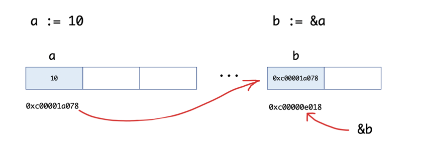

### 指针

与 Java 和 .NET 等编程语言不同，Go语言为程序员提供了控制数据结构指针的能力，但是，并不能进行指针运算。
Go语言允许你控制特定集合的数据结构、分配的数量以及内存访问模式，这对于构建运行良好的系统是非常重要的。
指针对于性能的影响不言而喻，如果你想要做系统编程、操作系统或者网络应用，指针更是不可或缺的一部分。

要搞明白Go语言中的指针需要先知道3个概念：指针地址、指针类型、指针取值。


#### Go语言中的指针
Go语言中的函数传参都是值拷贝，当我们想要修改某个变量的时候，我们可以创建一个指向该变量地址的指针变量。
传递数据使用指针，而无须拷贝数据。类型指针不能进行偏移和运算。Go语言中的指针操作非常简单，
只需要记住两个符号：`&（取地址）`和`*（根据地址取值`）。

##### 指针地址和指针类型
每个变量在运行时都拥有一个地址，这个地址代表变量在内存中的位置。
Go语言中使用`&`字符放在变量前面对变量进行“**取地址**”操作。 
Go语言中的值类型（int、float、bool、string、array、struct）都有对应的指针类型，如：`*int`、`*int64`、`*string`等。

取变量指针的语法如下：
```go
ptr := &v    // v的类型为T
```

其中：
```text
v:代表被取地址的变量，类型为T
ptr:用于接收地址的变量，ptr的类型就为*T，称做T的指针类型。*代表指针。
```
举个例子：
```go
package main

import "fmt"

func main() {
	a := 10
	b := &a
	fmt.Printf("a:%d ptr:%p\n", a, &a) // a:10 ptr:0xc00001a078
	fmt.Printf("b:%p type:%T\n", b, b) // b:0xc00001a078 type:*int
	fmt.Println(&b)                    // 0xc00000e018
}
```
我们来看一下b := &a的图示：



##### 指针取值

在对普通变量使用`&`操作符取地址后会获得这个变量的指针，然后可以对指针使用`*`操作，也就是指针取值，代码如下。

```go
package main

import "fmt"

func main() {
	// 指针取值
	a := 10
	b := &a // 取变量a的地址，将指针保存到b中
	fmt.Printf("type of b:%T\n", b)
	c := *b // 指针取值（根据指针去内存取值）
	fmt.Printf("type of c:%T\n", c)
	fmt.Printf("value of c:%v\n", c)
}
```
输出如下：
```text
type of b:*int
type of c:int
value of c:10
```
总结： 

取地址操作符`&`和取值操作符`*`是一对互补操作符，`&`取出地址，`*`根据地址取出地址指向的值。

变量、指针地址、指针变量、取地址、取值的相互关系和特性如下：

1. 对变量进行取地址（&）操作，可以获得这个变量的指针变量。
2. 指针变量的值是指针地址。
3. 对指针变量进行取值（*）操作，可以获得指针变量指向的原变量的值。

指针传值示例：

```go
package main

import "fmt"

func modify1(x int) {
	x = 100
}

func modify2(x *int) {
	*x = 100
}

func main() {
	a := 10
	modify1(a)
	fmt.Println(a) // 10
	modify2(&a)
	fmt.Println(a) // 100
}
```

#### 空指针

* 当一个指针被定义后没有分配到任何变量时，它的值为 nil
* 空指针的判断

```go
package main

import "fmt"

func main() {
    var p *string
    fmt.Println(p)
    fmt.Printf("p的值是%v\n", p)
    if p != nil {
        fmt.Println("非空")
    } else {
        fmt.Println("空值")
    }
}
```

#### new 和 make

我们先来看一个例子：

```go
package main

import "fmt"

func main() {
	var a *int
	*a = 100  // panic: runtime error: invalid memory address or nil pointer dereference
	fmt.Println(*a)

	var b map[string]int
	b["测试"] = 100  // panic: assignment to entry in nil map
	fmt.Println(b)
}

```
执行上面的代码会引发panic，为什么呢？

在Go语言中对于引用类型的变量，我们在使用的时候不仅要声明它，还要为它分配内存空间，否则我们的值就没办法存储。
而对于值类型的声明不需要分配内存空间，是因为它们在声明的时候已经默认分配好了内存空间。
要分配内存，就引出来今天的new和make。 Go语言中`new`和`make`是内建的两个函数，主要用来**分配内存**

##### new

new是一个内置的函数，它的函数签名如下：

`func new(Type) *Type`

其中
```text
 1. Type表示类型，new函数只接受一个参数，这个参数是一个类型
 2. *Type表示类型指针，new函数返回一个指向该类型内存地址的指针。
```
new函数不太常用，使用new函数得到的是一个类型的指针，并且该指针对应的值为该类型的零值。举个例子：
```go
package main

import "fmt"

func main() {
	a := new(int)
	b := new(bool)
	fmt.Printf("%T\n", a) // *int
	fmt.Printf("%T\n", b) // *bool
	fmt.Println(*a)       // 0
	fmt.Println(*b)       // false
}
```

本节开始的示例代码中`var a *int`只是声明了一个指针变量`a`但是没有初始化，指针作为引用类型需要初始化后才会拥有内存空间，才可以给它赋值。
应该按照如下方式使用内置的`new`函数对`a`进行初始化之后就可以正常对其赋值了：

```go
package main

import "fmt"

func main() {
	var a *int
	a = new(int)
	*a = 10
	fmt.Println(*a)
}
```

##### make
`make`也是用于内存分配的，区别于`new`，它只用于`slice`、`map`以及`chan`的内存创建，而且它返回的类型就是这三个类型本身，而不是他们的指针类型，因为这三种类型就是引用类型，所以就没有必要返回他们的指针了。

make函数的函数签名如下：

`func make(t Type, size ...IntegerType) Type`

`make`函数是无可替代的，我们在使用`slice`、`map`以及`channel`的时候，都需要使用`make`进行初始化，然后才可以对它们进行操作。
这个我们在上一章中都有说明，关于`channel`我们会在后续的章节详细说明。

本节开始的示例中`var b map[string]int`只是声明变量`b`是一个`map`类型的变量，需要像下面的示例代码一样使用`make`函数进行初始化操作之后，才能对其进行键值对赋值：
```go
package main

import "fmt"

func main() {
	var b map[string]int
	b = make(map[string]int, 10)
	b["测试"] = 100
	fmt.Println(b)
}
```

##### new与make的区别

1. 二者都是用来做内存分配的。
2. `make`只用于`slice`、`map`以及`channel`的初始化，返回的还是这三个引用类型本身；
3. 而`new`用于类型的内存分配，并且内存对应的值为类型零值，返回的是指向类型的指针。