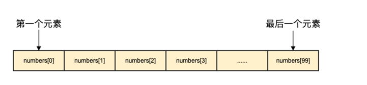
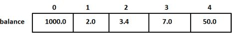

### 数组

数组是具有**相同唯一类型**的一组已编号且长度固定的数据项序列，这种类型可以是任意的原始类型例如整型、字符串或者自定义类型。

相对于去声明 `number0`, `number1`, `...`, `number99` 的变量，使用数组形式 `numbers[0]`, `numbers[1]`, `...`, `numbers[99]` 更加方便且易于扩展。

数组元素可以通过索引（位置）来读取（或者修改），索引从 0 开始，第一个元素索引为 0，第二个索引为 1，以此类推。




#### 声明数组
Go 语言数组声明需要指定元素类型及元素个数，语法格式如下：

```go
var variable_name [SIZE] variable_type
```

以上为一维数组的定义方式。

例如以下定义了数组 balance 长度为 10 类型为 float32：
```go
var balance [10] float32
```

#### 初始化数组
以下演示了数组初始化：
```go
var balance = [5]float32{1000.0, 2.0, 3.4, 7.0, 50.0}
```

我们也可以通过字面量在声明数组的同时快速初始化数组：
```go
balance := [5]float32{1000.0, 2.0, 3.4, 7.0, 50.0}
```
如果数组长度不确定，可以使用 ... 代替数组的长度，编译器会根据元素个数自行推断数组的长度：
```go
var balance = [...]float32{1000.0, 2.0, 3.4, 7.0, 50.0}
```
或者
```go
balance := [...]float32{1000.0, 2.0, 3.4, 7.0, 50.0}
```

如果设置了数组的长度，我们还可以通过指定下标来初始化元素：
```go
//  将索引为 1 和 3 的元素初始化
balance := [5]float32{1:2.0,3:7.0}
```
初始化数组中 `{} `中的元素个数不能大于 `[]`中的数字。

如果忽略 `[]` 中的数字不设置数组大小，Go 语言会根据元素的个数来设置数组的大小：

```balance[4] = 50.0```

以上实例读取了第五个元素。数组元素可以通过索引（位置）来读取（或者修改），索引从 0 开始，第一个元素索引为 0，第二个索引为 1，以此类推。



#### 访问数组元素
数组元素可以通过索引（位置）来读取。格式为数组名后加中括号，中括号中为索引的值。
例如：
```go
var salary float32 = balance[9]
```
以上实例读取了数组 balance 第 10 个元素的值。

以下演示了数组完整操作（声明、赋值、访问）的实例：

```go
package main

import "fmt"

func main() {
   var n [10]int /* n 是一个长度为 10 的数组 */
   var i,j int

   /* 为数组 n 初始化元素 */        
   for i = 0; i < 10; i++ {
      n[i] = i + 100 /* 设置元素为 i + 100 */
   }

   /* 输出每个数组元素的值 */
   for j = 0; j < 10; j++ {
      fmt.Printf("Element[%d] = %d\n", j, n[j] )
   }
}
```
以上实例执行结果如下：

```text
Element[0] = 100
Element[1] = 101
Element[2] = 102
Element[3] = 103
Element[4] = 104
Element[5] = 105
Element[6] = 106
Element[7] = 107
Element[8] = 108
Element[9] = 109
```