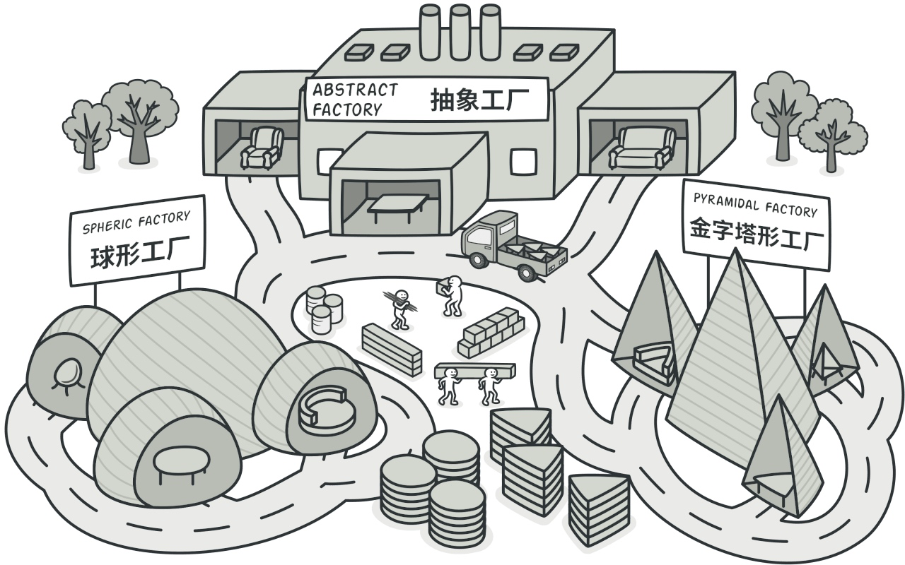

# 抽象工厂模式

抽象工厂模式是一种创建型设计模式， 它能创建一系列相关的对象， 而无需指定其具体类。



抽象工厂定义了用于创建不同产品的接口， 但将实际的创建工作留给了具体工厂类。 每个工厂类型都对应一个特定的产品变体。

在创建产品时， 客户端代码调用的是工厂对象的构建方法， 而不是直接调用构造函数 （`new`操作符）。 由于一个工厂对应一种产品变体， 因此它创建的所有产品都可相互兼容。

客户端代码仅通过其抽象接口与工厂和产品进行交互。 该接口允许同一客户端代码与不同产品进行交互。 你只需创建一个具体工厂类并将其传递给客户端代码即可。


## 概念示例
让我们假设一下， 如果你想要购买一组运动装备， 比如一双鞋与一件衬衫这样由两种不同产品组合而成的套装。 相信你会想去购买同一品牌的商品， 这样商品之间能够互相搭配起来。

如果我们把这样的行为转换成代码的话， 帮助我们创建此类产品组的工具就是抽象工厂， 便于产品之间能够相互匹配。

### iSportsFactory.go: 抽象工厂接口

```go
package main

import "fmt"

type ISportsFactory interface {
    makeShoe() IShoe
    makeShirt() IShirt
}

func GetSportsFactory(brand string) (ISportsFactory, error) {
    if brand == "adidas" {
        return &Adidas{}, nil
    }

    if brand == "nike" {
        return &Nike{}, nil
    }

    return nil, fmt.Errorf("Wrong brand type passed")
}
```

### adidas.go: 具体工厂
```go
package main

type Adidas struct {
}

func (a *Adidas) makeShoe() IShoe {
    return &AdidasShoe{
        Shoe: Shoe{
            logo: "adidas",
            size: 14,
        },
    }
}

func (a *Adidas) makeShirt() IShirt {
    return &AdidasShirt{
        Shirt: Shirt{
            logo: "adidas",
            size: 14,
        },
    }
}
```
### nike.go: 具体工厂
```go
package main

type Nike struct {
}

func (n *Nike) makeShoe() IShoe {
    return &NikeShoe{
        Shoe: Shoe{
            logo: "nike",
            size: 14,
        },
    }
}

func (n *Nike) makeShirt() IShirt {
    return &NikeShirt{
        Shirt: Shirt{
            logo: "nike",
            size: 14,
        },
    }
}
```
### iShoe.go: 抽象产品
```go
package main

type IShoe interface {
    setLogo(logo string)
    setSize(size int)
    getLogo() string
    getSize() int
}

type Shoe struct {
    logo string
    size int
}

func (s *Shoe) setLogo(logo string) {
    s.logo = logo
}

func (s *Shoe) getLogo() string {
    return s.logo
}

func (s *Shoe) setSize(size int) {
    s.size = size
}

func (s *Shoe) getSize() int {
    return s.size
}
```

### adidasShoe.go: 具体产品
```go
package main

type AdidasShoe struct {
    Shoe
}
```
###  nikeShoe.go: 具体产品
```go
package main

type NikeShoe struct {
    Shoe
}
```
### iShirt.go: 抽象产品
```go
package main

type IShirt interface {
    setLogo(logo string)
    setSize(size int)
    getLogo() string
    getSize() int
}

type Shirt struct {
    logo string
    size int
}

func (s *Shirt) setLogo(logo string) {
    s.logo = logo
}

func (s *Shirt) getLogo() string {
    return s.logo
}

func (s *Shirt) setSize(size int) {
    s.size = size
}

func (s *Shirt) getSize() int {
    return s.size
}
```
###  adidasShirt.go: 具体产品
```go
package main

type AdidasShirt struct {
    Shirt
}
```
###  nikeShirt.go: 具体产品
```go
package main

type NikeShirt struct {
    Shirt
}
```
###  main.go: 客户端代码
```go
package main

import "fmt"

func main() {
    adidasFactory, _ := GetSportsFactory("adidas")
    nikeFactory, _ := GetSportsFactory("nike")

    nikeShoe := nikeFactory.makeShoe()
    nikeShirt := nikeFactory.makeShirt()

    adidasShoe := adidasFactory.makeShoe()
    adidasShirt := adidasFactory.makeShirt()

    printShoeDetails(nikeShoe)
    printShirtDetails(nikeShirt)

    printShoeDetails(adidasShoe)
    printShirtDetails(adidasShirt)
}

func printShoeDetails(s IShoe) {
    fmt.Printf("Logo: %s", s.getLogo())
    fmt.Println()
    fmt.Printf("Size: %d", s.getSize())
    fmt.Println()
}

func printShirtDetails(s IShirt) {
    fmt.Printf("Logo: %s", s.getLogo())
    fmt.Println()
    fmt.Printf("Size: %d", s.getSize())
    fmt.Println()
}
```
### output.txt: 执行结果
```bash
Logo: nike
Size: 14
Logo: nike
Size: 14
Logo: adidas
Size: 14
Logo: adidas
Size: 14
```
