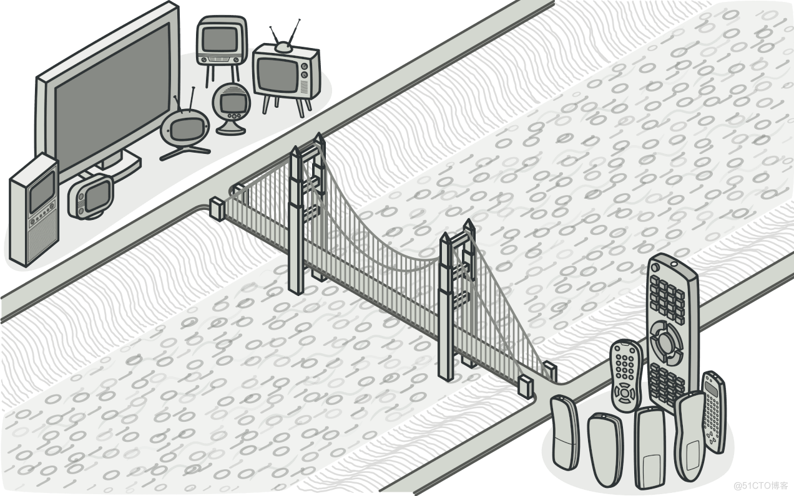

# 桥接模式

桥接是一种结构型设计模式， 可将业务逻辑或一个大类拆分为不同的层次结构， 从而能独立地进行开发。

层次结构中的第一层 （通常称为抽象部分） 将包含对第二层 （实现部分） 对象的引用。 抽象部分将能将一些 （有时是绝大部分） 对自己的调用委派给实现部分的对象。 所有的实现部分都有一个通用接口， 因此它们能在抽象部分内部相互替换。

## 概念示例
假设你有两台电脑： 一台 Mac 和一台 Windows。 还有两台打印机： 爱普生和惠普。 这两台电脑和打印机可能会任意组合使用。 客户端不应去担心如何将打印机连接至计算机的细节问题。

如果引入新的打印机， 我们也不会希望代码量成倍增长。 所以， 我们创建了两个层次结构， 而不是 2x2 组合的四个结构体：

抽象层： 代表计算机
实施层： 代表打印机
这两个层次可通过桥接进行沟通， 其中抽象层 （计算机） 包含对于实施层 （打印机） 的引用。 抽象层和实施层均可独立开发， 不会相互影响。

### computer.go: 抽象
```go
package main

type Computer interface {
    Print()
    SetPrinter(Printer)
}
```
### mac.go: 精确抽象
```go
package main

import "fmt"

type Mac struct {
    printer Printer
}

func (m *Mac) Print() {
    fmt.Println("Print request for mac")
    m.printer.PrintFile()
}

func (m *Mac) SetPrinter(p Printer) {
    m.printer = p
}
```
### windows.go: 精确抽象
```go
package main

import "fmt"

type Windows struct {
    printer Printer
}

func (w *Windows) Print() {
    fmt.Println("Print request for windows")
    w.printer.PrintFile()
}

func (w *Windows) SetPrinter(p Printer) {
    w.printer = p
}
```
### printer.go: 实施
```go
package main

type Printer interface {
    PrintFile()
}
```
### epson.go: 具体实施
```go
package main

import "fmt"

type Epson struct {
}

func (p *Epson) PrintFile() {
    fmt.Println("Printing by a EPSON Printer")
}
```
### hp.go: 具体实施
```go
package main

import "fmt"

type Hp struct {
}

func (p *Hp) PrintFile() {
    fmt.Println("Printing by a HP Printer")
}
```
### main.go: 客户端代码
```go
package main

import "fmt"

func main() {

    hpPrinter := &Hp{}
    epsonPrinter := &Epson{}

    macComputer := &Mac{}

    macComputer.SetPrinter(hpPrinter)
    macComputer.Print()
    fmt.Println()

    macComputer.SetPrinter(epsonPrinter)
    macComputer.Print()
    fmt.Println()

    winComputer := &Windows{}

    winComputer.SetPrinter(hpPrinter)
    winComputer.Print()
    fmt.Println()

    winComputer.SetPrinter(epsonPrinter)
    winComputer.Print()
    fmt.Println()
}
```
###  output.txt: 执行结果
```
Print request for mac
Printing by a HP Printer

Print request for mac
Printing by a EPSON Printer

Print request for windows
Printing by a HP Printer

Print request for windows
```