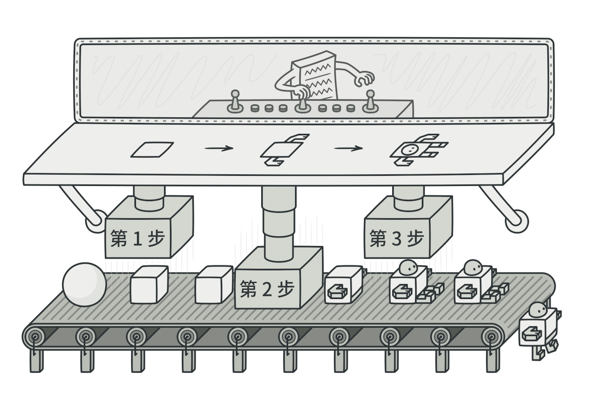

# go 设计模式-生成器模式

生成器是一种创建型设计模式， 使你能够分步骤创建复杂对象。

与其他创建型模式不同， 生成器不要求产品拥有通用接口。 这使得用相同的创建过程生成不同的产品成为可能。




## 概念示例
当所需产品较为复杂且需要多个步骤才能完成时， 也可以使用生成器模式。 在这种情况下， 使用多个构造方法比仅仅使用一个复杂可怕的构造函数更简单。 分为多个步骤进行构建的潜在问题是， 构建不完整的和不稳定的产品可能会被暴露给客户端。 生成器模式能够在产品完成构建之前使其处于私密状态。

在下方的代码中， 我们可以看到 `iglooBuilder冰屋生成器`与 `normalBuilder普通房屋生成器`可建造不同类型房屋， 即 `igloo冰屋`和 `normalHouse普通房屋` 。 每种房屋类型的建造步骤都是相同的。 主管 （可选） 结构体可对建造过程进行组织。

### iBuilder.go: 生成器接口
```go
package main

type IBuilder interface {
    setWindowType()
    setDoorType()
    setNumFloor()
    getHouse() House
}

func getBuilder(builderType string) IBuilder {
    if builderType == "normal" {
        return newNormalBuilder()
    }

    if builderType == "igloo" {
        return newIglooBuilder()
    }
    return nil
}
```

### normalBuilder.go: 具体生成器
```go
package main

type NormalBuilder struct {
    windowType string
    doorType   string
    floor      int
}

func newNormalBuilder() *NormalBuilder {
    return &NormalBuilder{}
}

func (b *NormalBuilder) setWindowType() {
    b.windowType = "Wooden Window"
}

func (b *NormalBuilder) setDoorType() {
    b.doorType = "Wooden Door"
}

func (b *NormalBuilder) setNumFloor() {
    b.floor = 2
}

func (b *NormalBuilder) getHouse() House {
    return House{
        doorType:   b.doorType,
        windowType: b.windowType,
        floor:      b.floor,
    }
}
```

### iglooBuilder.go: 具体生成器
```go
package main

type IglooBuilder struct {
    windowType string
    doorType   string
    floor      int
}

func newIglooBuilder() *IglooBuilder {
    return &IglooBuilder{}
}

func (b *IglooBuilder) setWindowType() {
    b.windowType = "Snow Window"
}

func (b *IglooBuilder) setDoorType() {
    b.doorType = "Snow Door"
}

func (b *IglooBuilder) setNumFloor() {
    b.floor = 1
}

func (b *IglooBuilder) getHouse() House {
    return House{
        doorType:   b.doorType,
        windowType: b.windowType,
        floor:      b.floor,
    }
}
```

###  house.go: 产品

package main
```go
type House struct {
    windowType string
    doorType   string
    floor      int
}
```

###  director.go: 主管
```go
package main

type Director struct {
    builder IBuilder
}

func newDirector(b IBuilder) *Director {
    return &Director{
        builder: b,
    }
}

func (d *Director) setBuilder(b IBuilder) {
    d.builder = b
}

func (d *Director) buildHouse() House {
    d.builder.setDoorType()
    d.builder.setWindowType()
    d.builder.setNumFloor()
    return d.builder.getHouse()
}
```

###  main.go: 客户端代码
```go
package main

import "fmt"

func main() {
    normalBuilder := getBuilder("normal")
    iglooBuilder := getBuilder("igloo")

    director := newDirector(normalBuilder)
    normalHouse := director.buildHouse()

    fmt.Printf("Normal House Door Type: %s\n", normalHouse.doorType)
    fmt.Printf("Normal House Window Type: %s\n", normalHouse.windowType)
    fmt.Printf("Normal House Num Floor: %d\n", normalHouse.floor)

    director.setBuilder(iglooBuilder)
    iglooHouse := director.buildHouse()

    fmt.Printf("\nIgloo House Door Type: %s\n", iglooHouse.doorType)
    fmt.Printf("Igloo House Window Type: %s\n", iglooHouse.windowType)
    fmt.Printf("Igloo House Num Floor: %d\n", iglooHouse.floor)

}
```

###  output.txt: 执行结果
```
Normal House Door Type: Wooden Door
Normal House Window Type: Wooden Window
Normal House Num Floor: 2

Igloo House Door Type: Snow Door
Igloo House Window Type: Snow Window
Igloo House Num Floor: 1
```