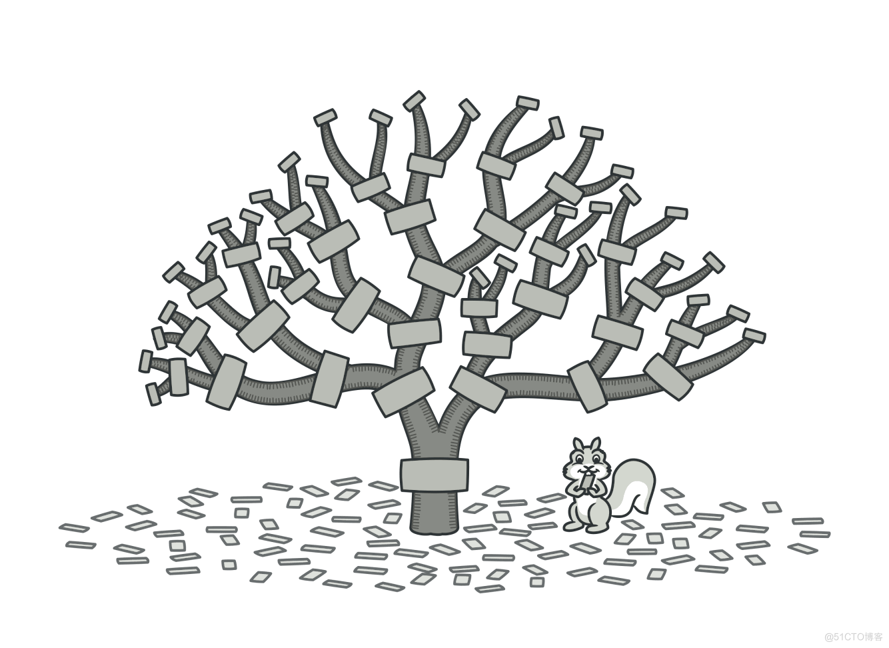

#  组合模式

组合是一种结构型设计模式， 你可以使用它将对象组合成树状结构， 并且能像使用独立对象一样使用它们。

对于绝大多数需要生成树状结构的问题来说， 组合都是非常受欢迎的解决方案。 组合最主要的功能是在整个树状结构上递归调用方法并对结果进行汇总。



## 概念示例
让我们试着用一个操作系统文件系统的例子来理解组合模式。 文件系统中有两种类型的对象： 文件和文件夹。 在某些情形中， 文件和文件夹应被视为相同的对象。 这就是组合模式发挥作用的时候了。

想象一下， 你需要在文件系统中搜索特定的关键词。 这一搜索操作需要同时作用于文件和文件夹上。 对于文件而言， 其只会查看文件的内容； 对于文件夹则会在其内部的所有文件中查找关键词。

### file.go: 组件接口
```go
package main

import "fmt"

type File struct {
    name string
}

func (f *File) search(keyword string) {
    fmt.Printf("Searching for keyword %s in file %s\n", keyword, f.name)
}

func (f *File) getName() string {
    return f.name
}
```
### folder.go: 组合
```go
package main

import "fmt"

type Folder struct {
    components []Component
    name       string
}

func (f *Folder) search(keyword string) {
    fmt.Printf("Serching recursively for keyword %s in folder %s\n", keyword, f.name)
    for _, composite := range f.components {
        composite.search(keyword)
    }
}

func (f *Folder) add(c Component) {
    f.components = append(f.components, c)
}
```

### component.go: 叶子
```go
package main

type Component interface {
    search(string)
}
```
### main.go: 客户端代码
```go
package main

func main() {
    file1 := &File{name: "File1"}
    file2 := &File{name: "File2"}
    file3 := &File{name: "File3"}

    folder1 := &Folder{
        name: "Folder1",
    }

    folder1.add(file1)

    folder2 := &Folder{
        name: "Folder2",
    }
    folder2.add(file2)
    folder2.add(file3)
    folder2.add(folder1)

    folder2.search("rose")
}
```
### output.txt: 执行结果
```text
Serching recursively for keyword rose in folder Folder2
Searching for keyword rose in file File2
Searching for keyword rose in file File3
Serching recursively for keyword rose in folder Folder1
Searching for keyword rose in file File1
```