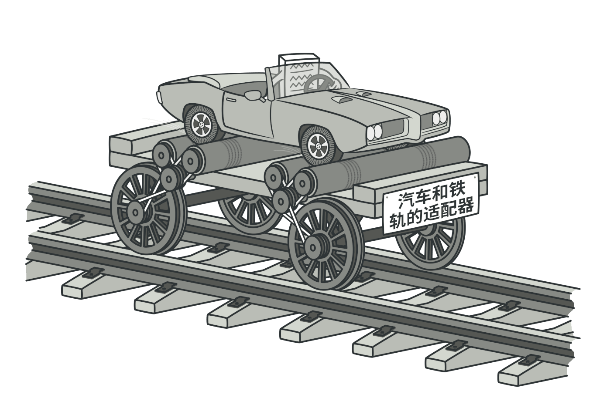

# 适配器模式
适配器是一种结构型设计模式， 它能使不兼容的对象能够相互合作。

适配器可担任两个对象间的封装器， 它会接收对于一个对象的调用， 并将其转换为另一个对象可识别的格式和接口。



## 概念示例
这里有一段客户端代码， 用于接收一个对象 （Lightning 接口） 的部分功能， 不过我们还有另一个名为 adaptee 的对象 （Windows 笔记本）， 可通过不同的接口 （USB 接口） 实现相同的功能

这就是适配器模式发挥作用的场景。 我们可以创建这样一个名为 adapter 的结构体：

遵循符合客户端期望的相同接口 （Lightning 接口）。

可以适合被适配对象的方式对来自客户端的请求进行 “翻译”。 适配器能够接受来自 Lightning 连接器的信息， 并将其转换成 USB 格式的信号， 同时将信号传递给 Windows 笔记本的 USB 接口。
### client.go: 客户端代码
```go
package main

import "fmt"

type Client struct {
}

func (c *Client) InsertLightningConnectorIntoComputer(com Computer) {
    fmt.Println("Client inserts Lightning connector into computer.")
    com.InsertIntoLightningPort()
}
```

### computer.go: 客户端接口
```go
package main

type Computer interface {
    InsertIntoLightningPort()
}
```
###  mac.go: 服务
```go
package main

import "fmt"

type Mac struct {
}

func (m *Mac) InsertIntoLightningPort() {
    fmt.Println("Lightning connector is plugged into mac machine.")
}
```
###  windows.go: 未知服务
```go
package main

import "fmt"

type Windows struct{}

func (w *Windows) insertIntoUSBPort() {
    fmt.Println("USB connector is plugged into windows machine.")
}
```
### windowsAdapter.go: 适配器
```go
package main

import "fmt"

type WindowsAdapter struct {
    windowMachine *Windows
}

func (w *WindowsAdapter) InsertIntoLightningPort() {
    fmt.Println("Adapter converts Lightning signal to USB.")
    w.windowMachine.insertIntoUSBPort()
}
```
### main.go
```go
package main

func main() {

    client := &Client{}
    mac := &Mac{}

    client.InsertLightningConnectorIntoComputer(mac)

    windowsMachine := &Windows{}
    windowsMachineAdapter := &WindowsAdapter{
        windowMachine: windowsMachine,
    }

    client.InsertLightningConnectorIntoComputer(windowsMachineAdapter)
}
```

### output.txt: 执行结果
```
Client inserts Lightning connector into computer.
Lightning connector is plugged into mac machine.
Client inserts Lightning connector into computer.
Adapter converts Lightning signal to USB.
USB connector is plugged into windows machine.
```