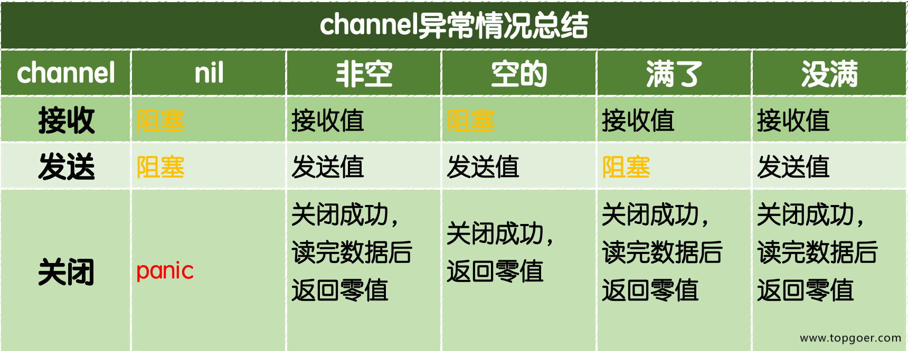

### Channel

#### channel

单纯地将函数并发执行是没有意义的。函数与函数间需要交换数据才能体现并发执行函数的意义。

虽然可以使用共享内存进行数据交换，但是共享内存在不同的goroutine中容易发生竞态问题。
为了保证数据交换的正确性，必须使用互斥量对内存进行加锁，这种做法势必造成性能问题。

Go语言的并发模型是CSP（Communicating Sequential Processes），提倡通过通信共享内存而不是通过共享内存而实现通信。

如果说goroutine是Go程序并发的执行体，channel就是它们之间的连接。channel是可以让一个goroutine发送特定值到另一个goroutine的通信机制。

Go 语言中的通道（channel）是一种特殊的类型。通道像一个传送带或者队列，总是遵循先入先出（First In First Out）的规则，保证收发数据的顺序。
每一个通道都是一个具体类型的导管，也就是声明channel的时候需要为其指定元素类型。

#### channel类型

channel是一种类型，一种引用类型。声明通道类型的格式如下：
`var 变量名 chan 变量类型`

举几个例子：

```go
var ch1 chan int  // 声明一个传递整型的通道
var ch2 chan bool // 声明一个传递布尔型的通道
var ch3 chan []int // 声明一个传递int切片的通道  
```

#### 创建channel

通道是引用类型，通道类型的空值是nil。

```go
var ch chan int
fmt.Println(ch) // <nil>
```

声明的通道后需要使用make函数初始化之后才能使用。

创建channel的格式如下： channel的缓冲大小是可选的。

`make(chan 元素类型, [缓冲大小])`

举几个例子：

```go
ch4 := make(chan int)
ch5 := make(chan bool)
ch6 := make(chan []int)  
```

#### channel操作

通道有 发送（send）、接收(receive）和关闭（close）三种操作。

发送和接收都使用`<-`符号。

现在我们先使用以下语句定义一个通道：

```go
ch := make(chan int)
```

* 发送

  将一个值发送到通道中。

  `ch <- 10 // 把10发送到ch中`

* 接收

  从一个通道中接收值。

    ```go
    x := <- ch // 从ch中接收值并赋值给变量x
    <-ch       // 从ch中接收值，忽略结果  
    ```

* 关闭

  我们通过调用内置的close函数来关闭通道。

  `close(ch)`

  关于关闭通道需要注意的事情是，只有在通知接收方goroutine所有的数据都发送完毕的时候才需要关闭通道。
  通道是可以被垃圾回收机制回收的，它和关闭文件是不一样的，在结束操作之后关闭文件是必须要做的，但关闭通道不是必须的。

关闭后的通道有以下特点：

1. 对一个关闭的通道再发送值就会导致panic。
2. 对一个关闭的通道进行接收会一直获取值直到通道为空。
3. 对一个关闭的并且没有值的通道执行接收操作会得到对应类型的零值。
4. 关闭一个已经关闭的通道会导致panic。

#### 无缓冲的通道


无缓冲的通道又称为阻塞的通道。我们来看一下下面的代码：

```go
func main() {
ch := make(chan int)
ch <- 10
fmt.Println("发送成功")
}   
```

上面这段代码能够通过编译，但是执行的时候会出现以下错误：

    fatal error: all goroutines are asleep - deadlock!

    goroutine 1 [chan send]:
    main.main()
    	.../go-study/7-并发编程/src/demo-channel.go:12 +0x54  

为什么会出现deadlock错误呢？

因为我们使用ch := make(chan int) 创建的是无缓冲的通道，无缓冲的通道只有在有人接收值的时候才能发送值。
就像你住的小区没有快递柜和代收点，快递员给你打电话必须要把这个物品送到你的手中，简单来说就是无缓冲的通道必须有接收才能发送。

上面的代码会阻塞在ch <- 10这一行代码形成死锁，那如何解决这个问题呢？

一种方法是启用一个goroutine去接收值，例如：

```go
func recv(c chan int) {
ret := <- c
fmt.Println("接收成功", ret)
}
func main() {
ch := make(chan int)
go recv(ch) // 启用goroutine从通道接收值
ch <- 10
fmt.Println("发送成功")
}   
```

无缓冲通道上的发送操作会阻塞，直到另一个goroutine在该通道上执行接收操作，这时值才能发送成功，两个goroutine将继续执行。
相反，如果接收操作先执行，接收方的goroutine将阻塞，直到另一个goroutine在该通道上发送一个值。

使用无缓冲通道进行通信将导致发送和接收的goroutine同步化。因此，无缓冲通道也被称为同步通道。

#### 有缓冲的通道

解决上面问题的方法还有一种就是使用有缓冲区的通道。


我们可以在使用make函数初始化通道的时候为其指定通道的容量，例如：

```go
func main() {
ch := make(chan int, 1) // 创建一个容量为1的有缓冲区通道
ch <- 10
fmt.Println("发送成功")
} 
```

只要通道的容量大于0，那么该通道就是有缓冲的通道，通道的容量表示通道中能存放元素的数量。
就像你小区的快递柜只有那么个多格子，格子满了就装不下了，就阻塞了，等到别人取走一个快递员就能往里面放一个。

我们可以使用内置的len函数获取通道内元素的数量，使用cap函数获取通道的容量，虽然我们很少会这么做。

#### close()  关闭 channel

可以通过内置的close()函数关闭channel（如果你的管道不往里存值或者取值的时候一定记得关闭管道）

```go
package main

import "fmt"

func main() {
	// 创建int类型通道
	c := make(chan int)
	// goroutine 匿名函数发送数据
	go func() {
		for i := 0; i < 5; i++ {
			c <- i
		}
		close(c)
	}()
	// 接收数据
	for {
		if data, ok := <-c; ok {
			fmt.Println(data)
		} else {
			break
		}
	}
	fmt.Println("main结束")
}
```

#### 如何优雅的从通道循环取值

当通过通道发送有限的数据时，我们可以通过close函数关闭通道来告知从该通道接收值的goroutine停止等待。
当通道被关闭时，往该通道发送值会引发panic，从该通道里接收的值一直都是类型零值。那如何判断一个通道是否被关闭了呢？

我们来看下面这个例子：

```go
package main

import (
	"fmt"
)

func exampleChan() {
	ch1 := make(chan int)
	ch2 := make(chan int)

	// 开启goroutine将0~10的数发送到ch1中
	go func() {
		for i := 0; i < 10; i++ {
			ch1 <- i
		}
		close(ch1)
	}()

	// 开启goroutine从ch1中接收值，并将该值的平方发送到ch2中
	go func() {
		for {
			if i, ok := <-ch1; ok {
				ch2 <- i * i
				continue
			}
			close(ch2)
			break
		}
	}()
	// 通道关闭后会退出for range循环
	for i := range ch2 {
		fmt.Println(i)
	}
}

func main() {
	exampleChan()
}
```

从上面的例子中我们看到有两种方式在接收值的时候判断通道是否被关闭，我们通常使用的是for range的方式。

#### 单向通道

有的时候我们会将通道作为参数在多个任务函数间传递，很多时候我们在不同的任务函数中使用通道都会对其进行限制，比如限制通道在函数中只能发送或只能接收。

Go语言中提供了单向通道来处理这种情况。例如，我们把上面的例子改造如下：
```go
func counter(out chan<- int) {
    for i := 0; i < 100; i++ {
        out <- i
    }
    close(out)
}

func squarer(out chan<- int, in <-chan int) {
    for i := range in {
        out <- i * i
    }
    close(out)
}
func printer(in <-chan int) {
    for i := range in {
        fmt.Println(i)
    }
}

func main() {
    ch1 := make(chan int)
    ch2 := make(chan int)
    go counter(ch1)
    go squarer(ch2, ch1)
    printer(ch2)
}   
```
其中
1. `chan<- int`是一个只能发送的通道，可以发送但是不能接收
2. `<-chan int`是一个只能接收的通道，可以接收但是不能发送  

在函数传参及任何赋值操作中将双向通道转换为单向通道是可以的，但反过来是不可以的。

#### 通道总结
channel常见的异常总结，如下图：


